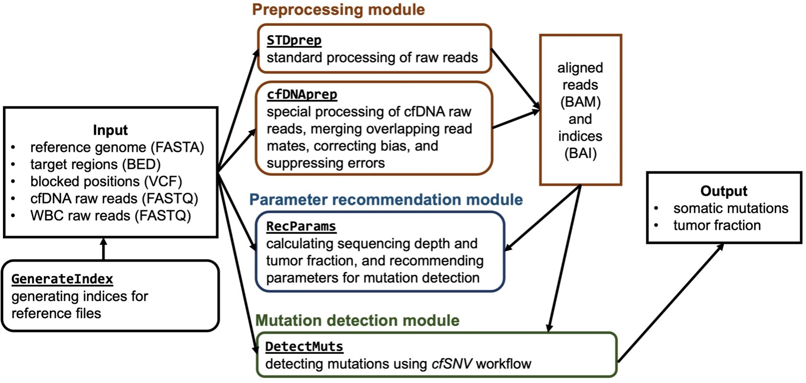

# cfSNV Docker


## Overview

`cfSNV` is an ultra-sensitive and accurate somatic SNV caller designed for cfDNA sequencing. Taking advantage of modern statistical models and machine learning approaches, `cfSNV` provides hierarchical mutation profiling and multi-layer error suppression, including error suppression in read mates, site-level error filtration and read-level error filtration. 

Here we present a Docker image of the `cfSNV` package, which is designed such that researchers and clinicians with a limited computational background can easily carry out analyses on both high-performance computing platforms and local computers.

`cfSNV Docker` can be freely used for educational and research purposes by non-profit institutions and U.S. government agencies only under the UCLA Academic Software License. For information on the use for a commercial purpose or by a commercial or for-profit entity, please contact Prof. Xiangong Jasmine Zhou (https://zhoulab.dgsom.ucla.edu/).


## Equipment setup

The Docker container can be built and run on most operating systems, including Windows, MacOS, or Linux.

#### 1. Install Docker 

Get Docker from https://docs.docker.com/get-docker/.

#### 2. Download cfSNV Dockerfile

Download our latest `Dockerfile` from https://github.com/jasminezhoulab/cfSNV_docker/releases. Save the `Dockerfile` to your `working_directory`

#### 3. Create cfSNV Docker image

After starting the Docker software and enter the `working_directory`, type the following command:

```bash
cfsnv_image=user_specified_name
docker build . –t ${cfsnv_image}
```

#### 4. Create cfSNV Docker container and mount data directory

Users need to specify two directory paths for mounting: (1) a local directory called `local_directory` on the host machine, where all input data are located, and (2) a container directory called `container_directory`, through which the data on the host machine can be accessed in the container. Type the following command:

```	bash
local_directory=/HOST_PATH/TO/INPUT
container_directory=/CONTAINER_PATH/TO/INPUT
cfsnv_container=user_specified_name
docker run -it -d -v ${local_directory}:${container_directory} --name ${cfsnv_container} ${cfsnv_image} bash
```

#### 5. Run cfSNV Docker container

Then, execute the following line to start the container:

```bash
docker exec -it ${cfsnv_container} bash
```

#### Tips

1. If users want to remove the existing container and create a new one with the same name, execute:

   ```bash
   docker rm -f ${cfsnv_container}
   ```

   Then repeat step 4 and 5.

2. If we release a new Dockerfile version, download the new file and rebuild the Docker image by executing:

   ```bash
   docker build . --no-cache -t ${cfsnv_image}
   ```


## Pipeline

There are three main modules in the `cfSNV Docker` package: preprocessing, parameter recommendation, and mutation detection. 



The detailed usage of each function can be found using flag `-h` (help). For example, to check how to use `DetectMuts`, type the following command in the container directory `/home/cfSNV`:

```
./DetectMuts -h
```

which will return:

```bash
This function outputs the variant list to a VCF file and writes the tumor fraction to a TXT file.

Usage: ./DetectMuts -p ${plasma} -n ${normal} -e ${extended} -u ${uncombined} -t ${target} -g ${genome} -d ${database} -i ${id} -mh ${minHold} -mp ${minPass} -o ${output}
	-p|--plasma a BAM file of the cfDNA sequencing data
	-n|--normal a BAM file of the normal sample sequencing data
	-e|--extended a BAM file of the combined cfDNA reads
	-u|--uncombined a BAM file of the cfDNA reads that are not combined
	-t|--target a BED file of target regions
	-g|--genome a FASTA file of the reference genome
	-d|--database a VCF file of the positions that are blocked from mutation calling, e.g. a common SNP database
	-i|--id a sample ID name
	-mh|--minHold a minimum number of supporting read pairs that are required for mutations in the HOLD category. Default is 12
	-mp|--minPass a minimum number of supporting read pairs that are required for mutations in the PASS category. Default is 5
	-o|--output an output directory for the variant list
```


## Example data and test demo data

The example data can be downloaded by executing the script `DownloadEg`:

```bash
./DownloadEg
```

The demo data for quick testing is available at https://zenodo.org/record/6450376/files/demo_data.tar.gz. 


## The demo output

The output of running `RecParams` on the demo data:

```bash
Sample ID: demo_cfDNA

The per base coverage of the plasma sample for each genomic region in the target bed file:
average = 149.833, median = 139.046, 95th percentile = 280.356 

The roughly estimated tumor fraction in the plasma sample: 10.025% 
For a more accurate estimation, please run DetectMuts. 

Lowest detectable VAF range under the default parameters: [1.783%, 4.28%] 

To detect different levels of lowest VAF, 
at 1% VAF: MIN_HOLD_SUPPORT_COUNT = 9, MIN_PASS_SUPPORT_COUNT = 3; 
at 5% VAF: MIN_HOLD_SUPPORT_COUNT = 20, MIN_PASS_SUPPORT_COUNT = 14 
Note: decreasing the parameters (i.e. MIN_HOLD_SUPPORT_COUNT and MIN_PASS_SUPPORT_COUNT) 
can lower the detection limit, but may also lower the variant quality.
```

The output of running `DetectMuts` on the demo data, including the `${id}.tumor_fraction.txt` file:

```bash
demo_cfDNA tumor fraction: 10.4117553285%
```

and the `${id}.variant_list.vcf` file:

```bash
##fileformat=VCFv4.2
##fileDate=20220417
##source=demo_cfDNA
##reference=demo_reference_files/demo_ref_genome.fa
##INFO=<ID=VAF,Number=1,Type=Float,Description="Variant Allele Frequency">
##FILTER=<ID=ID,Description="PASS if this position has passed all filters">
#CHROM	POS	ID	REF	ALT	QUAL	FILTER	INFO
chr22	22730851	.	A	G	4.76876578963686e+29	PASS	VAF=0.177570093458
chr22	22730852	.	T	C	8.5492017941142e+28	PASS	VAF=0.173076923077
chr22	22730853	.	G	C	2.79763925080629e+32	PASS	VAF=0.173076923077
chr22	25115549	.	T	G	9.66499609454881e+71	PASS	VAF=0.189189189189
chr22	25570329	.	C	T	643924.75349	PASS	VAF=0.026315789474
chr22	29179472	.	C	T	518422.76463	PASS	VAF=0.056179775281
chr22	40660923	.	C	G	754256842110353792	PASS	VAF=0.078651685393
chr22	41363836	.	C	T	665638501276337	PASS	VAF=0.042553191489
chr22	42899171	.	T	C	13161.69048	PASS	VAF=0.054794520548
chr22	45723880	.	T	G	246.7265	PASS	VAF=0.069767441860
```


## Citation

Shuo Li, Zorawar S. Noor, Weihua Zeng, Mary L. Stackpole, Xiaohui Ni, Yonggang Zhou, Zuyang Yuan, Wing Hung Wong, Vatche G. Agopian, Steven M. Dubinett, Frank Alber, Wenyuan Li, Edward B. Garon, and Xianghong J. Zhou. Sensitive detection of tumor mutations from blood and its application to immunotherapy prognosis. Nature Communications. 2021 Jul 7;12(1):4172. doi: 10.1038/s41467-021-24457-2. PMID: 34234141; PMCID: PMC8263778.

